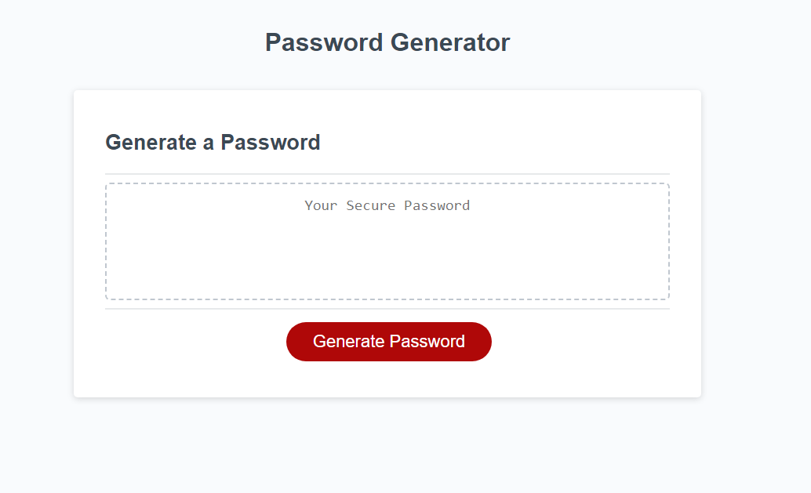

# Password Generator Starter Code
Description: This assignment, I am creating apassword generator. This software tool or program designed to create strong, random, and secure passwords for various online accounts and applications. The primary purpose of a password generator is to enhance cybersecurity by generating complex passwords that are difficult for attackers to guess or crack through brute force attacks.

Screenshot: 

Github Repo: https://github.com/ColumbiaCoding/PassGen
Link to deployed application: https://columbiacoding.github.io/PassGen/
